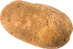

# Markdown

## \#\# Smaller header

### \#\#\# Even smaller header

Regular text

**\*\*Bold text\*\***

*\*Italicized text\**

\~\~~~Struck through text~~\~\~

Unordered List
- \- one
- \- two
- \- seven

Ordered List
1. 1\. Ay
2. 2\. Bee
3. 3\. See

\``code`\`

[\[Link\]\(https://www.example.com\)](https://www.godieinahole.com)

\!\[Image\]\(potato.png\)

> \> Block Quote
>> \>\> Blockier Quote

Checklist
- [x] \- \[x] aa
- [ ] \- \[ ] bb
- [x] \- \[x] cc

footnote \[^1] [^1]

Table\||With\||Headers
:--------|:--------:|--------:
\:Left align\||\:Center align:\||Right align\:

Horizontal Rule

\-\-\-

---

Footnotes

[^1]: \[^1]: ack ack